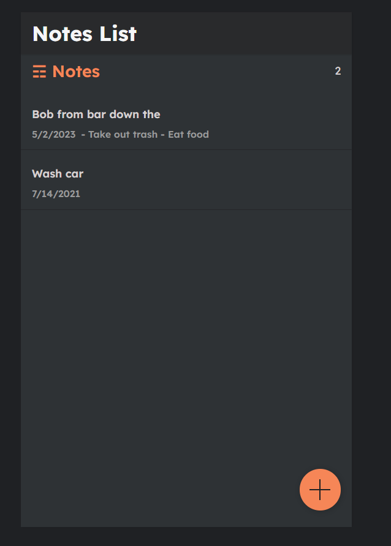

## CRUD NOTES APP
1. - npm install
2. - npm run server //STARTS JSON SERVER ON PORT 5000
3. - npm start  //STARTS REACT SERVER

# The app uses a json server which serves as a backend to the frontend

# Notes List Images
